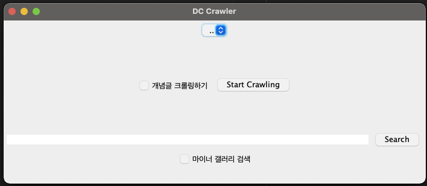
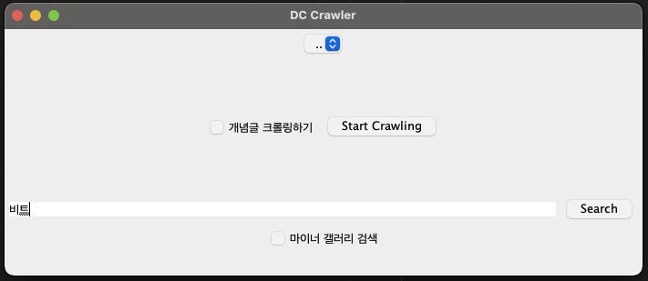
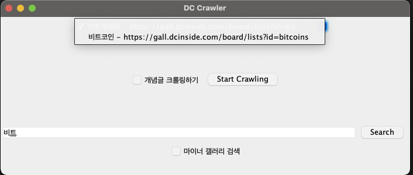
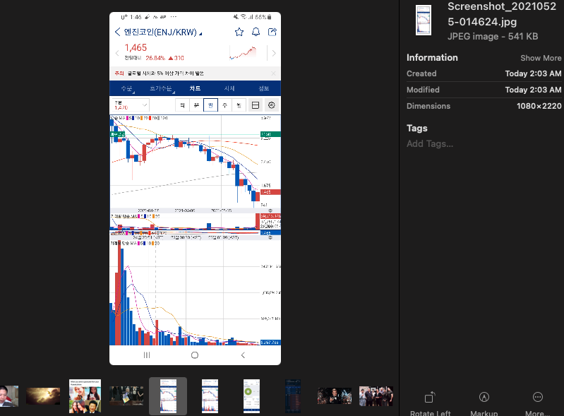

# DC Image Scraper
웹 사이트 [dcinside](https://www.dcinside.com/) 이미지 스크래이퍼

# Feature
- 갤러리 검색
  - 메인
  - 마이너
- 이미지 스크레핑
  - 모든 게시글
  - 개념글
  
# How to run?
```shell
git clone https://github.com/wjrmffldrhrl/dc_crawler.git
cd dc_crawler
sh gradlew build
cp ./build/libs/dc_crawler-1.0-SNAPSHOT.jar ./dc_crawler.jar
java -jar ./dc_crawler.jar 

```
  
# How to use?
### 첫 화면

### 갤러리 검색

- 아래 입력 공간에 갤러리 이름 입력
- search 버튼 클릭
### 검색된 갤러리 선택

- 검색된 결과 중 원하는 갤러리 선택
- Start 클릭

### 스크래이핑 결과

- 스크래이핑 결과는 현재 디렉터리 내부 img 내부에 생성


